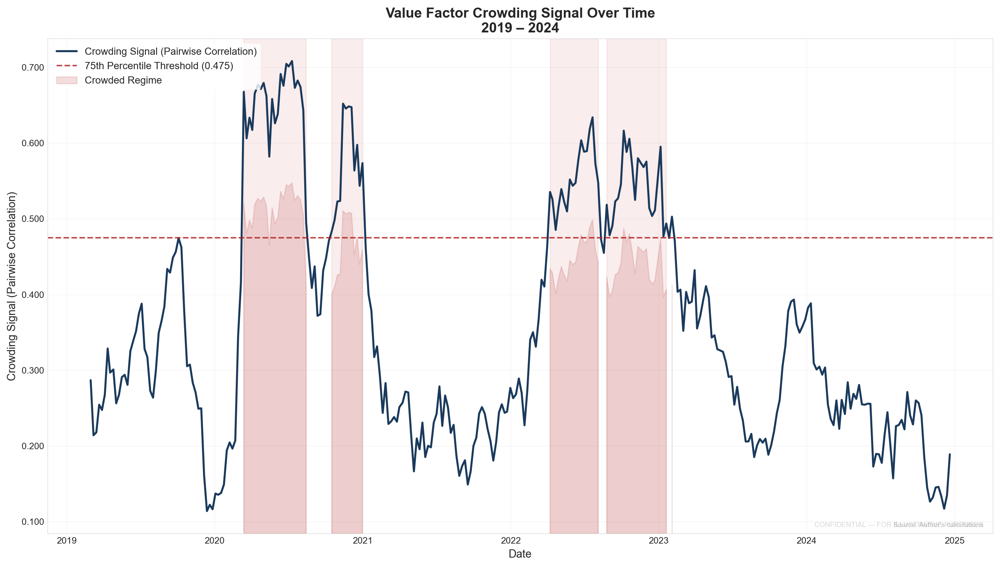
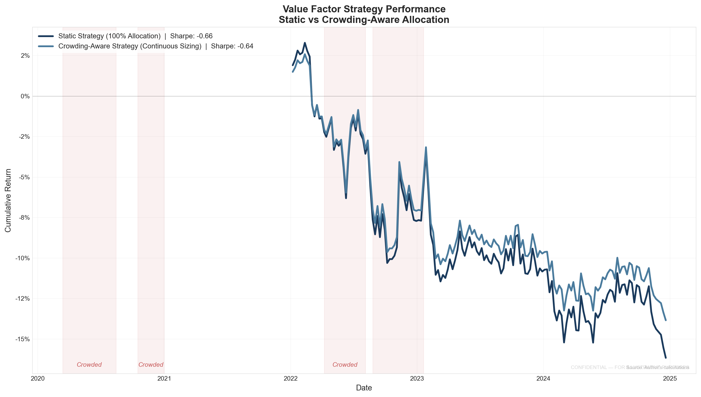
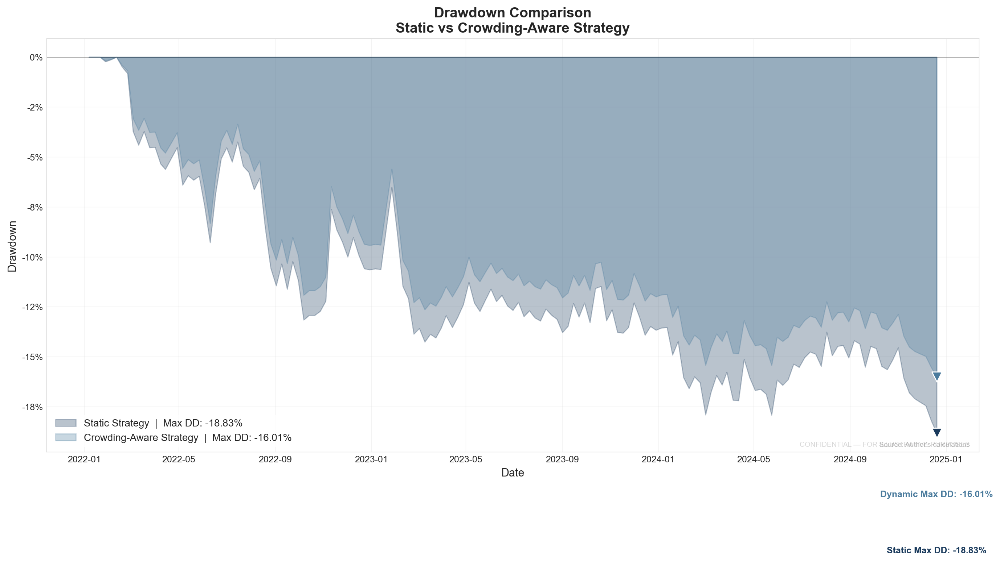
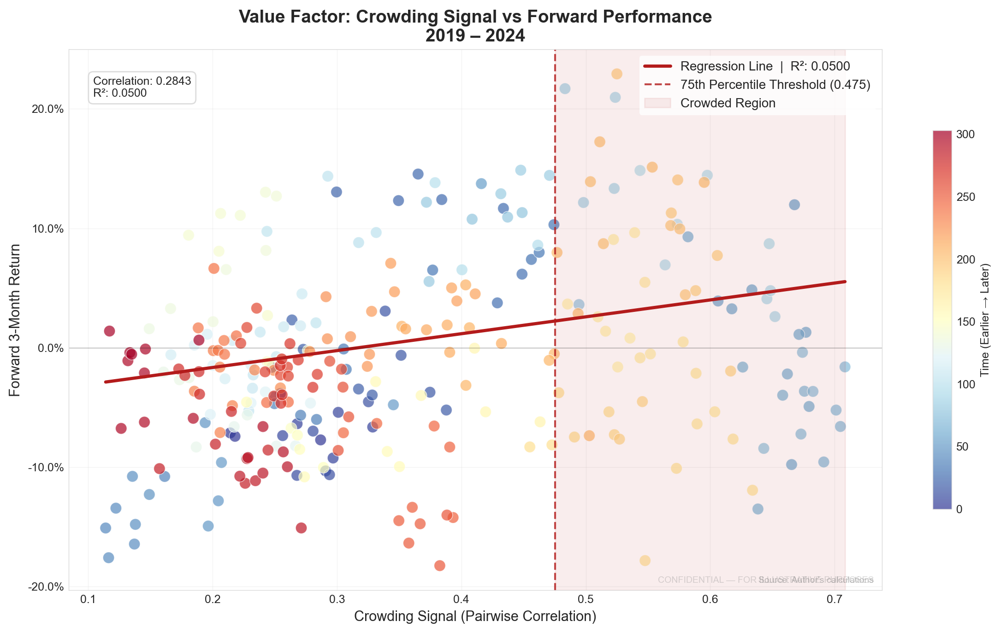

# Measuring the Crowd: Detecting Factor Capacity Risk and Modeling Alpha Decay in U.S. Equities

A data science project investigating whether observable crowding metrics can predict changes in factor performance in the S&P 500.

---

## Overview

In quantitative investing, a consistently profitable trading signal may be a finite resource. As more capital chases well‑known factors like value or momentum, the act of trading itself can erode the signal's future profitability—a phenomenon often called **alpha decay**.

This project asks: **Can we detect when a factor becomes crowded and quantify any subsequent decline in its predictive power?**

The goal is not to discover new alpha. It is to explore whether a simple, interpretable crowding metric could help a hypothetical systematic manager decide when to reduce exposure to their own signals. The work frames crowding as an anomaly detection problem in the cross‑sectional behavior of factor portfolios.

---

## Research Question

Can a cross‑sectional crowding score for standard equity factors (Value, Momentum) predict the future decay of that factor's information coefficient (IC)?

Specifically: **Do patterns of high correlation and concentrated exposure within a factor's top‑quintile stocks precede a decline in forward factor performance?**

---

## What This Project Found (Summary)

- **Value factor:** The raw pairwise correlation of stocks in the top quintile showed the strongest predictive signal in this sample. A logistic regression using `correlation_raw` to predict 3‑month forward returns achieved an F1 score of **0.9483**.
- **Momentum factor:** The signal was weaker. The best result came from using a z‑score of the HHI feature (`hhi_z`) to predict a Spearman 6‑week IC, with an F1 of **0.6593**.
- **Trading strategy:** A continuous sizing approach (using linear regression to predict forward returns and scaling position sizes accordingly) showed a modest out‑of‑sample Sharpe improvement of **+0.0182** and a max drawdown reduction of **2.82%** compared to a static allocation.
- **Binary threshold rules** (reducing exposure by a fixed percentage when crowding exceeded a percentile) did not improve Sharpe ratios in this sample.

These results are specific to the data and period analyzed (2019–2024 for training, 2022–2024 for out‑of‑sample testing).

---

## Project Scope

| Dimension | Specification |
|-----------|---------------|
| **Factors** | Momentum (12‑1 month) and Value (inverse momentum proxy) |
| **Universe** | S&P 500 constituents |
| **Lookback Period** | 5 years of daily data (2018–2024) |
| **Crowding Proxies** | 3 implemented metrics (see Feature Engineering) |
| **Prediction Target** | Forward returns at various horizons and Spearman IC |
| **Modeling Approach** | Staged: baseline models first, advanced models only if baseline showed signal |
| **Output** | Crowding signal plots, strategy performance metrics, and a backtest comparison |

---

## Data Sources

| Source | Data | Frequency |
|--------|------|-----------|
| `yfinance` | S&P 500 constituent prices | Daily |
| Wikipedia | S&P 500 constituent list | Static (scraped) |

*Note: 13F institutional ownership and short interest data were not implemented in this version.*

---

## Feature Engineering

Three crowding proxies were constructed from raw price data:

| # | Feature | Description |
|---|---------|-------------|
| 1 | **Pairwise Correlation** | Average pairwise correlation of daily returns among stocks in the factor's top quintile (60‑day rolling window) |
| 2 | **Herfindahl‑Hirschman Index (HHI)** | Concentration of factor exposure across the universe |
| 3 | **Valuation Spread** | Price spread between top and bottom quintiles (proxy for valuation dispersion) |

Additional transformed features were generated from these, including squared terms, rolling percentiles, deltas, log transforms, and z‑scores.

---

## Modeling Strategy

A staged approach was used: simple baselines were built first, and more complex methods were only considered if the baseline showed a meaningful signal.

### Baseline Models

- **Logistic regression** using the composite z‑score (and later individual features) to predict negative forward returns.
- **Linear regression** using pairwise correlation to predict forward factor returns.

### Advanced Models (Conditional)

- **Isolation Forest** for regime identification (crowded vs. normal periods).
- **LightGBM** for non‑linear prediction.

In this project, the advanced models did not consistently outperform the simpler baselines.

---

## Evaluation Framework

The project was evaluated using:

| Metric | What It Measures |
|--------|------------------|
| **F1 Score** | Classification performance of crowding signals |
| **R²** | Regression performance of crowding signals |
| **Sharpe Ratio** | Risk‑adjusted returns of the strategy |
| **Max Drawdown** | Worst cumulative loss during the test period |
| **Annualized Volatility** | Variability of strategy returns |

### Backtest Design

Two strategies were compared over an out‑of‑sample period (2022–2024):
1. **Static allocation:** Constant 100% exposure to the Value factor.
2. **Crowding‑aware allocation:** Position size scaled continuously based on linear regression predictions of forward returns.

---

## Key Results

### Feature Transform Experiment
- **Value:** `correlation_raw` gave the best F1 score (**0.8155**).
- **Momentum:** `hhi_z` gave the best F1 score (**0.6061**).

### Target Definition Experiment
- **Value:** `forward_3m` gave the best F1 score (**0.9483**).
- **Momentum:** `spearman_6w` gave the best F1 score (**0.6593**).

### Out‑of‑Sample Strategy Performance (Value Factor, Continuous Sizing)

| Metric | Static Strategy | Crowding‑Aware Strategy | Improvement |
|--------|----------------|------------------------|-------------|
| Total Return | -16.17% | -13.85% | +2.32% |
| Sharpe Ratio (Annualized) | -0.6569 | -0.6386 | +0.0182 |
| Max Drawdown | -18.83% | -16.01% | -2.82% |
| Annualized Volatility | 8.46% | 7.40% | +1.06% |
| Average Exposure | 100.0% | 83.7% | N/A |

*Results are from the out‑of‑sample period (2022–2024) and may not generalize to other time periods or markets.*

---

## Visualizations

The following figures illustrate the analysis. Click on any image to view it at full resolution.

---

### Figure 1: Crowding Signal Over Time

*Value factor crowding signal (pairwise correlation) with 75th percentile threshold. Shaded regions indicate periods identified as crowded.*

---

### Figure 2: Cumulative Returns Comparison

*Static vs. crowding‑aware strategy cumulative returns (out‑of‑sample, 2022–2024).*

---

### Figure 3: Drawdown Comparison

*Max drawdown comparison. Crowding‑aware strategy reduced max drawdown from -18.83% to -16.01% in this sample.*

---

### Figure 4: Crowding vs. Forward Return Scatter

*Relationship between crowding signal and forward 3‑month returns. Correlation: 0.2843, R²: 0.0500 in this sample.*

---

## Repository Structure

```
factor-crowding-risk/
├── README.md                        # Project overview and documentation
├── src/
│   ├── data.py                      # Data loading and preprocessing
│   ├── features.py                  # Feature engineering functions
│   ├── models.py                    # Model training and evaluation
│   ├── run_feature_experiment.py    # Batch 1: feature transform tests
│   ├── run_target_experiment.py     # Batch 2: target definition tests
│   ├── run_backtest.py              # Binary threshold backtest (50% reduction)
│   ├── run_backtest_smaller.py      # Smaller reduction backtests (10%, 20%, 30%)
│   ├── run_batch3_combined.py       # Continuous sizing, decision tree, Ridge/Lasso
│   ├── run_visualizations.py        # Generates plots and metrics table
│   └── generate_paper.py            # Generates the final PDF report
├── docs/                            # Final report and visualizations (tracked)
├── outputs/                         # Temporary generated files (gitignored)
├── requirements.txt
└── .gitignore
```

---

## Setup & Installation

```bash
# Clone the repository
git clone https://github.com/kira-ml/factor-crowding-risk.git
cd factor-crowding-risk

# Create a virtual environment
python -m venv venv
source venv/bin/activate  # On Windows: venv\Scripts\activate

# Install dependencies
pip install -r requirements.txt
```

---

## Dependencies

```
pandas>=1.5.0
numpy>=1.23.0
yfinance>=0.2.0
scikit-learn>=1.2.0
lightgbm>=3.3.0
matplotlib>=3.6.0
seaborn>=0.12.0
scipy>=1.9.0
requests>=2.28.0
reportlab>=4.0.0
```

---

## Limitations

- The analysis uses publicly available price data only; 13F institutional ownership and short interest were not implemented.
- Only two factors (Value and Momentum) were analyzed.
- The universe is limited to S&P 500 stocks.
- The 5‑year window (2019–2024) may not capture multi‑cycle behavior.
- Macroeconomic regimes were not controlled for.
- The backtest assumes frictionless trading and does not model transaction costs, market impact, or short‑selling constraints.
- The analysis identifies statistical associations, not causal relationships.

---

## License

MIT

---

## Author

**Ken Ira Lacson**

- GitHub: [github.com/kira-ml](https://github.com/kira-ml)
- LinkedIn: [linkedin.com/in/ken-ira-lacson-852026343](https://www.linkedin.com/in/ken-ira-lacson-852026343/)

---

*This project was developed as a portfolio demonstration of applied machine learning for quantitative finance. It is not investment advice and does not claim to generate alpha or beat the market.*